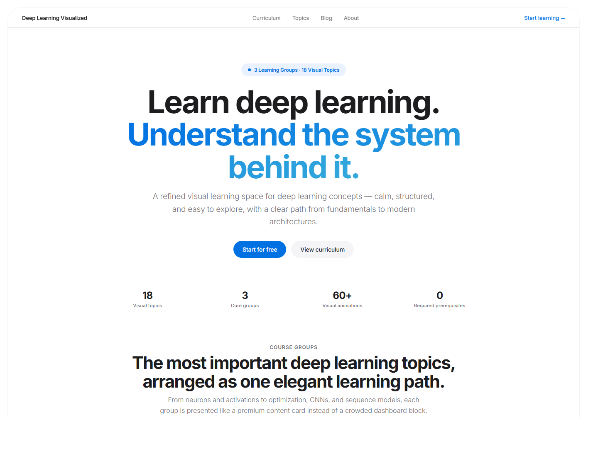
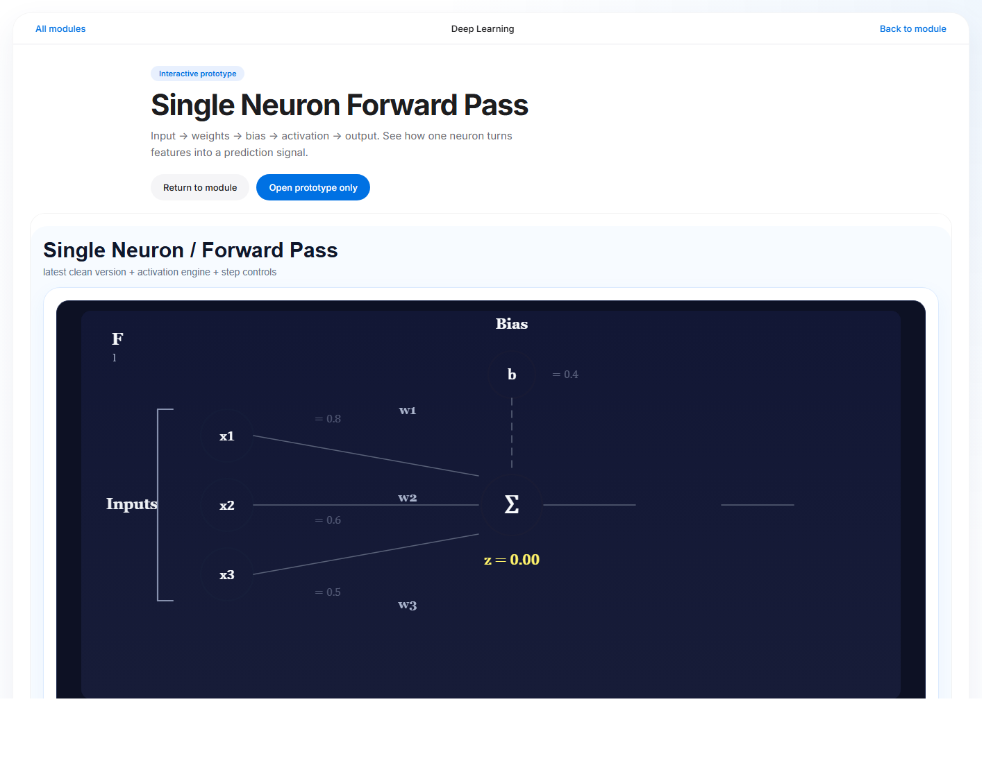
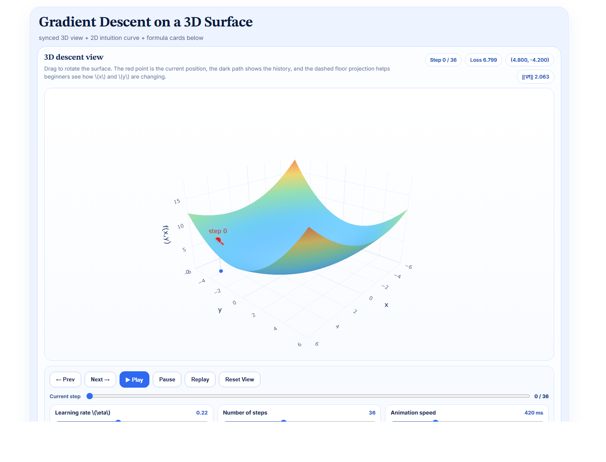

# Deep Learning Visualized

A beginner-friendly visual learning library for deep learning concepts.

Deep Learning Visualized is built for learners who want to understand deep learning not only through formulas or static diagrams, but through clear visual explanations, interactive animations, and step-by-step data flow.

Many deep learning concepts are difficult to imagine at first. A single neuron, backpropagation, convolution, attention, or recurrent network is not just a name or a formula. Each one is a process: data moves forward, signals are transformed, gradients flow backward, and parameters change over time.

This project tries to make those processes easier to see.

## Preview







## Live Demo

https://deep-learning-visualized.vercel.app

## What This Project Is

Deep Learning Visualized is a visual knowledge library for deep learning beginners.

It is designed to help learners:

- see how data flows through a model
- understand what happens step by step
- interact with parameters and observe changes
- connect visual intuition with core formulas
- explore important deep learning topics in a structured way

The goal is not to replace a full deep learning course. Instead, this project acts as a companion resource for building intuition before going deeper into mathematical derivations, implementation details, or advanced theory.

## Topics Covered

The current website includes visual explanations for topics such as:

### Neural Network Foundations

- Single Neuron Forward Pass
- Activation Functions Comparison
- Loss Functions
- Backpropagation Intuition
- Gradient Descent & Learning Rate
- Overfitting vs. Underfitting
- Dropout
- Adam Optimizer vs. SGD

### CNN and Sequence Models

- Convolution Operation
- Pooling and Downsampling
- Feature Map Visualization
- RNN Structure
- Attention Mechanism Intuition

### Model Training and Practice

- Train / Val / Test Split
- Evaluation Metrics & Confusion Matrix
- Bias vs. Variance Diagnosis
- Mini-batch Training & Batch Size
- Transfer Learning Intuition

More topics are still being refined and added over time.

## Project Goals

This project focuses on visual intuition first.

Each topic is designed to be:

- beginner-friendly
- visually clear
- interactive where useful
- focused on one concept at a time
- connected to practical deep learning understanding

The project avoids unnecessary complexity where possible. It does not aim to provide full mathematical proofs or complete research-level coverage. Instead, it focuses on helping learners build a strong mental model of how deep learning components work.

## Tech Stack

This project is built with:

- Next.js
- React
- TypeScript
- CSS
- HTML / Canvas-based visualizations
- Vercel for deployment

## Getting Started

Clone the repository:

```bash
git clone https://github.com/Jerry-0821/deep-learning-visualized.git
cd deep-learning-visualized
```

Install dependencies:

```bash
npm install
```

Run the development server:

```bash
npm run dev
```

Open the local site:

```bash
http://localhost:3000
```

Build for production:

```bash
npm run build
```

## Project Structure

```text
app/          Main Next.js app routes and pages
components/   Reusable UI and visualization components
data/         Topic and curriculum data
public/       Static assets and prototype files
scripts/      Utility scripts
```

Some folders or files may change as the project continues to evolve.

## Visualization Source Files

The original Colab-runnable visualization notebooks and prototype files are stored in `visualization-source/`. These files are kept separately from the main Next.js website code so the project is easier to understand and maintain.

## Project Status

This project is in active development.

Some visual topics are already available, while others are still being improved. The content, layout, topic structure, and visual explanations may continue to change as the project becomes clearer and more complete.

## Disclaimer

This is an independent deep learning visualization project.

It is not an official course, textbook, or certification program. It is intended as a supplementary learning resource for students and beginners who want to build better visual intuition for deep learning concepts.

## License

This project is released under the MIT License.

You are free to use, modify, and learn from the code, as long as the license notice is preserved.
